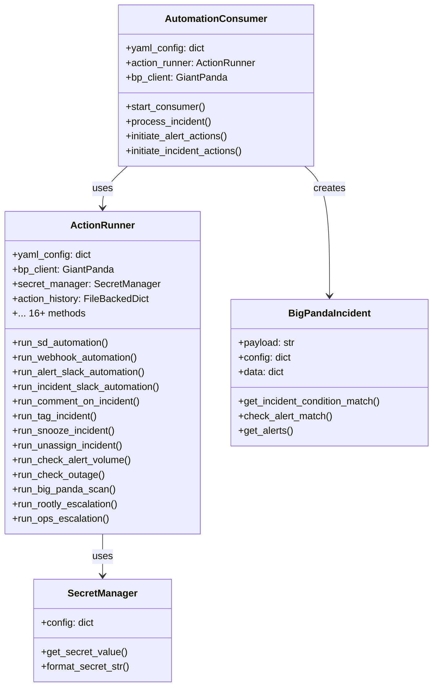
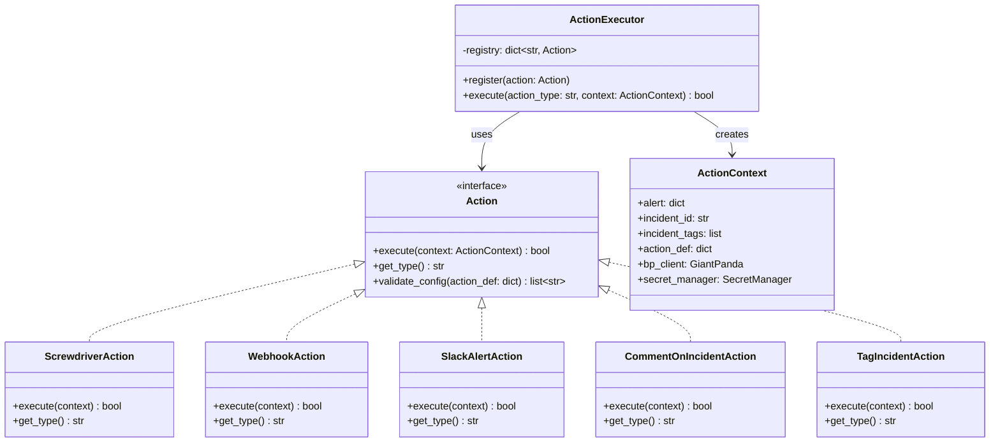
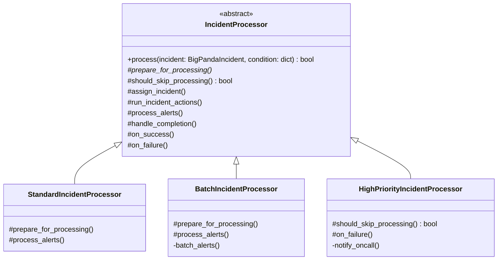
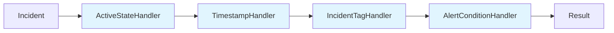
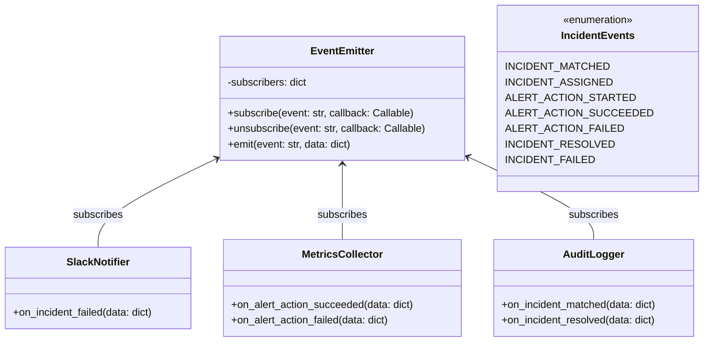
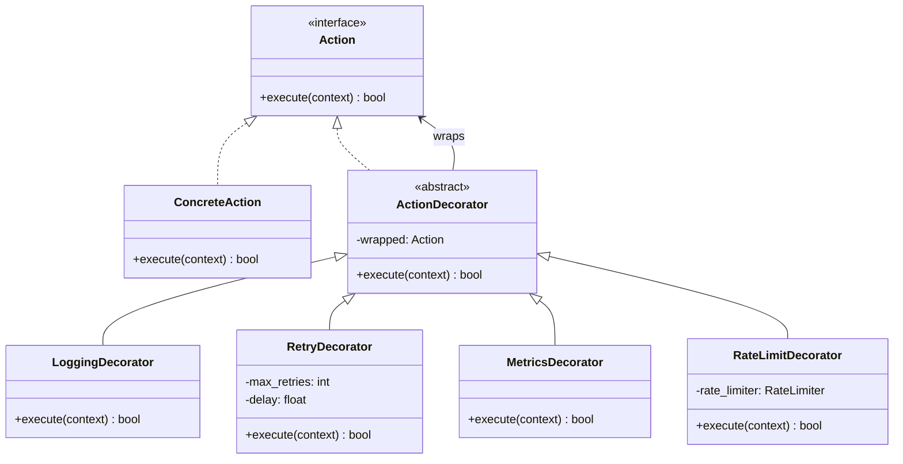

# Design Patterns Refactoring Strategy

> **Document Purpose**: Analysis and implementation plan for refactoring `yahoo.kafka_consumer` using Gang of Four design patterns.  
> **Reference**: "Design Patterns: Elements of Reusable Object-Oriented Software" (Gamma, Helm, Johnson, Vlissides, 1994)  
> **Created**: February 2026  
> **Status**: Planning  
> **Approach**: Incremental refactoring

---

## Table of Contents

1. [Current Architecture Analysis](#current-architecture-analysis)
2. [Pain Points Identified](#pain-points-identified)
3. [Recommended Design Patterns](#recommended-design-patterns)
4. [Pattern 1: Strategy Pattern for Actions](#pattern-1-strategy-pattern-for-actions)
5. [Pattern 2: Template Method for Processing Flow](#pattern-2-template-method-for-processing-flow)
6. [Pattern 3: Factory Method for Action Creation](#pattern-3-factory-method-for-action-creation)
7. [Pattern 4: Chain of Responsibility for Condition Matching](#pattern-4-chain-of-responsibility-for-condition-matching)
8. [Pattern 5: Observer Pattern for Event Notification](#pattern-5-observer-pattern-for-event-notification)
9. [Pattern 6: Decorator Pattern for Action Enhancement](#pattern-6-decorator-pattern-for-action-enhancement)
10. [Implementation Roadmap](#implementation-roadmap)
11. [Migration Strategy](#migration-strategy)

---

## Current Architecture Analysis

### Class Inventory

| Class | File | Lines | Responsibility |
|-------|------|-------|----------------|
| `ActionRunner` | action_runner.py | 2179 | Execute 16+ action types, track history, manage API clients |
| `AutomationConsumer` | automation_consumer.py | 726 | Kafka consumption, incident processing orchestration |
| `BigPandaIncident` | bigpanda_incident.py | 257 | Parse incident data, evaluate conditions |
| `ConfigValidator` | config_validator.py | 744 | Validate YAML configuration structure |
| `SecretManager` | secret_manager.py | 99 | Fetch secrets from CKMS |
| `OutageCache` | outage_cache.py | 137 | Cache outage detection results |
| `OpsDBUtilities` | opsdb_utilities.py | 99 | Query OpsDB, build ticket descriptions |
| `FileBackedDict` | file_backed_dict.py | 71 | Persistent dictionary storage |
| `RateLimiter` | utilities.py | 46 | Token bucket rate limiting |

### Current Architecture Diagram



---

## Pain Points Identified

### 1. **God Class Anti-Pattern** (ActionRunner)

`ActionRunner` at 2179 lines violates the Single Responsibility Principle (SRP). It:
- Manages 16+ different action types with separate `run_*` methods
- Handles API clients (BigPanda, Rootly, Screwdriver)
- Tracks action history
- Performs variable substitution
- Manages rate limiting

**Impact**: 
- Adding a new action type requires modifying this massive class
- Testing individual actions requires mocking the entire class
- Hard to understand and maintain

### 2. **Conditional Logic Explosion**

Action dispatch uses long if-elif chains:

```python
# In run_alert_actions()
if action_def['type'] == 'screwdriver':
    ok = self.run_sd_automation(alert, action_def)
elif action_def['type'] == 'alert_slack':
    ok = self.run_alert_slack_automation(alert, action_def)
elif action_def['type'] == 'webhook':
    ok = self.run_webhook_automation(alert, action_def)
elif action_def['type'] == 'comment_on_incident':
    ok = self.run_comment_on_incident(action_def, incident_id, alert=alert)
else:
    logging.error("Action type %s not supported", action_def['type'])
    return False
```

**Impact**:
- Open/Closed Principle violation (must modify existing code to add new types)
- Duplicated dispatch logic in multiple methods
- Error-prone when adding new action types

### 3. **Tight Coupling**

Components are tightly coupled:
- `ActionRunner` directly instantiates API clients
- `AutomationConsumer` directly creates `BigPandaIncident` objects
- No dependency injection

**Impact**:
- Difficult to unit test (must mock external dependencies)
- Can't swap implementations (e.g., test vs production API clients)

### 4. **Processing Flow Rigidity**

The incident processing flow in `AutomationConsumer.process_incident()` is hardcoded:

```python
def process_incident(self, bp_incident, matched_condition):
    # Fixed sequence of steps
    prepared_data = self._prepare_incident_for_processing(...)
    if not self._assign_incident_to_service_account(...):
        return False
    if not self._run_incident_level_actions(...):
        return False
    if not self._split_unsupported_alerts(...):
        return False
    # etc.
```

**Impact**:
- Can't easily add new processing phases
- Can't customize the flow for different incident types

### 5. **Condition Matching Complexity**

`BigPandaIncident.get_incident_condition_match()` has complex nested logic for evaluating conditions:

```python
for incident_idx, incident in enumerate(inc_conditions):
    incident_matched = True
    # Check max_seconds_since_updated
    # Check top level conditions
    # Check tag conditions
    # Check alert conditions
    if incident_matched:
        return incident
```

**Impact**:
- Adding new condition types requires modifying existing logic
- Hard to test individual conditions in isolation

---

## Recommended Design Patterns

Based on the analysis, here are the GoF patterns that will provide the most value:

| Priority | Pattern | Target Component | Benefit |
|----------|---------|------------------|---------|
| **P0** | Strategy | ActionRunner | Eliminate if-elif chains, make actions pluggable |
| **P0** | Factory Method | ActionRunner | Centralize action creation, enable registration |
| **P1** | Template Method | AutomationConsumer | Standardize processing flow, allow customization |
| **P1** | Chain of Responsibility | BigPandaIncident | Modular condition evaluation |
| **P2** | Observer | AutomationConsumer | Decouple notifications from processing |
| **P2** | Decorator | Actions | Add cross-cutting concerns (logging, retry, metrics) |
| **P3** | Singleton | SecretManager | Cache secrets, ensure single instance |
| **P3** | Composite | ConfigValidator | Hierarchical validation rules |

---

## Pattern 1: Strategy Pattern for Actions

### Intent
> "Define a family of algorithms, encapsulate each one, and make them interchangeable. Strategy lets the algorithm vary independently from clients that use it."

### Problem Solved
The `ActionRunner` class contains 16+ `run_*` methods, one for each action type. Adding a new action requires:
1. Adding a new method to `ActionRunner`
2. Adding a new elif branch in `run_alert_actions()`
3. Adding another elif branch in `run_incident_actions()`
4. Updating `run_alert_fallback_actions()` and `run_incident_fallback_actions()`

### Solution
Extract each action type into its own class implementing a common `Action` interface.

### New Architecture



### Code Example

**Before (current):**
```python
class ActionRunner:
    def run_alert_actions(self, alert, matched_condition, incident_id):
        for action_name in alert_action_list:
            action_def = next((ad for ad in action_definitions if ad['name'] == action_name), None)
            
            if action_def['type'] == 'screwdriver':
                ok = self.run_sd_automation(alert, action_def)
            elif action_def['type'] == 'alert_slack':
                ok = self.run_alert_slack_automation(alert, action_def)
            elif action_def['type'] == 'webhook':
                ok = self.run_webhook_automation(alert, action_def)
            # ... 13 more elif branches
            else:
                logging.error("Action type %s not supported", action_def['type'])
                return False
```

**After (with Strategy):**
```python
# actions/base.py
from abc import ABC, abstractmethod
from dataclasses import dataclass
from typing import Optional

@dataclass
class ActionContext:
    """Encapsulates all data needed by actions."""
    action_def: dict
    incident_id: str
    bp_client: 'GiantPanda'
    bp_env_id: str
    secret_manager: 'SecretManager'
    # Optional - only for alert-level actions
    alert: Optional[dict] = None
    # Optional - only for incident-level actions
    incident_tags: Optional[list[dict]] = None
    all_alerts: Optional[list[dict]] = None
    supported_alerts: Optional[list[dict]] = None
    alert_count: int = 0


class Action(ABC):
    """Base class for all action types."""
    
    @property
    @abstractmethod
    def action_type(self) -> str:
        """Return the action type identifier (e.g., 'screwdriver', 'webhook')."""
        pass
    
    @abstractmethod
    def execute(self, context: ActionContext) -> bool:
        """Execute the action. Returns True on success, False on failure."""
        pass
    
    def validate_config(self, action_def: dict) -> list[str]:
        """Validate action-specific configuration. Returns list of errors."""
        return []


# actions/screwdriver_action.py
class ScrewdriverAction(Action):
    """Execute a Screwdriver CI/CD job."""

    @property
    def action_type(self) -> str:
        return 'screwdriver'
    
    def execute(self, context: ActionContext) -> bool:
        logging.info("Running Screwdriver automation")
        alert_params = self._extract_alert_params(context.alert, context.action_def)
        sd_params = {context.action_def['job_name']: alert_params}
        
        sd_token = context.secret_manager.get_secret_value(context.action_def['auth_secret'])
        sd_tools = sdv4_tools(
            context.action_def['pipeline_id'],
            sd_token,
            context.action_def['polling_timeout']
        )
        
        event_id = sd_tools.trigger_sd_job(context.action_def['job_name'], sd_params)
        return sd_tools.sd_event_done_wait(event_id, context.action_def['polling_interval'])
    
    def validate_config(self, action_def: dict) -> list[str]:
        errors = []
        required = ['job_name', 'pipeline_id', 'auth_secret', 'polling_timeout', 'polling_interval']
        for param in required:
            if param not in action_def:
                errors.append(f"Missing required parameter '{param}' for screwdriver action")
        return errors


# actions/webhook_action.py
class WebhookAction(Action):
    """Send HTTP request to a webhook."""
    
    @property
    def action_type(self) -> str:
        return 'webhook'
    
    def execute(self, context: ActionContext) -> bool:
        logging.info("Running webhook automation")
        # ... implementation
        return True


# action_executor.py
class ActionExecutor:
    """Registry and executor for action strategies."""
    
    def __init__(self):
        self._registry: dict[str, Action] = {}
    
    def register(self, action: Action) -> None:
        """Register an action strategy."""
        self._registry[action.action_type] = action
        logging.info("Registered action type: %s", action.action_type)
    
    def execute(self, action_type: str, context: ActionContext) -> bool:
        """Execute an action by type."""
        action = self._registry.get(action_type)
        if not action:
            logging.error("Unknown action type: %s", action_type)
            return False
        return action.execute(context)
    
    def get_supported_types(self) -> list[str]:
        """Return list of registered action types."""
        return list(self._registry.keys())


# Usage in AutomationConsumer or refactored ActionRunner:
class ActionRunner:
    def __init__(self, yaml_config: dict):
        self.executor = ActionExecutor()
        # Register all action types
        self.executor.register(ScrewdriverAction())
        self.executor.register(WebhookAction())
        self.executor.register(SlackAlertAction())
        # ... register all actions
    
    def run_alert_actions(self, alert, matched_condition, incident_id):
        for action_name in matched_condition['alert_actions']:
            action_def = self._get_action_def(action_name)
            context = ActionContext(
                action_def=action_def,
                incident_id=incident_id,
                alert=alert,
                bp_client=self.bp_client,
                bp_env_id=self.bp_env_id,
                secret_manager=self.secret_manager,
            )
            ok = self.executor.execute(action_def['type'], context)
            if not ok:
                return False
        return True
```

### Benefits

| Aspect | Improvement |
|--------|-------------|
| **Open/Closed** | Add new actions without modifying existing code |
| **Single Responsibility** | Each action class handles one thing |
| **Testability** | Test each action in isolation |
| **Code Organization** | Actions live in separate files |
| **Discovery** | Easy to see what actions exist |

### File Structure After Refactor

```
src/yahoo/kafka_consumer/
├── actions/
│   ├── __init__.py
│   ├── base.py                    # Action ABC, ActionContext
│   ├── screwdriver_action.py
│   ├── webhook_action.py
│   ├── slack_alert_action.py
│   ├── slack_incident_action.py
│   ├── comment_action.py
│   ├── tag_incident_action.py
│   ├── snooze_action.py
│   ├── unassign_action.py
│   ├── check_alert_volume_action.py
│   ├── check_outage_action.py
│   ├── scan_bigpanda_action.py
│   ├── scan_servicenow_action.py
│   ├── rootly_escalation_action.py
│   └── ops_escalation_action.py
├── action_executor.py             # Registry + execution
├── automation_consumer.py         # Simplified, no action logic
└── ...
```

---

## Pattern 2: Template Method for Processing Flow

### Intent
> "Define the skeleton of an algorithm in an operation, deferring some steps to subclasses. Template Method lets subclasses redefine certain steps of an algorithm without changing the algorithm's structure."

### Problem Solved
The incident processing flow in `process_incident()` is a fixed sequence of steps. Different incident types might need:
- Different validation rules
- Custom pre/post processing hooks
- Skipping certain phases

### Solution
Define the processing skeleton with hook methods that can be overridden.

### New Architecture



### Code Example

**After (with Template Method):**
```python
from abc import ABC, abstractmethod

class IncidentProcessor(ABC):
    """
    Template Method pattern for incident processing.
    Defines the skeleton of the processing algorithm.
    """

    def __init__(self, action_executor: ActionExecutor, bp_client: GiantPanda):
        self.action_executor = action_executor
        self.bp_client = bp_client
    
    def process(self, incident: BigPandaIncident, matched_condition: dict) -> bool:
        """
        Template method - defines the processing algorithm.
        Subclasses can override hook methods to customize behavior.
        """
        # Step 1: Prepare
        context = self.prepare_for_processing(incident, matched_condition)
        if context is None:
            return False
        
        # Step 2: Check if we should skip
        if self.should_skip_processing(context):
            self.on_skip(context)
            return False
        
        # Step 3: Assign incident
        if not self.assign_incident(context):
            self.on_failure(context, "assignment")
            return False
        
        # Step 4: Run incident-level actions
        if not self.run_incident_actions(context):
            self.on_failure(context, "incident_actions")
            return False
        
        # Step 5: Process alerts
        alerts_succeeded = self.process_alerts(context)
        
        # Step 6: Handle completion
        if alerts_succeeded:
            self.on_success(context)
            return self.handle_success(context)
        else:
            self.on_failure(context, "alert_actions")
            return self.handle_failure(context)
    
    # --- Abstract methods (must be implemented) ---
    
    @abstractmethod
    def prepare_for_processing(self, incident, condition) -> dict | None:
        """Prepare context for processing. Return None to skip."""
        pass
    
    @abstractmethod
    def process_alerts(self, context: dict) -> bool:
        """Process alerts. Return True if all succeeded."""
        pass
    
    # --- Hook methods (can be overridden) ---
    
    def should_skip_processing(self, context: dict) -> bool:
        """Hook: check if processing should be skipped."""
        return False
    
    def assign_incident(self, context: dict) -> bool:
        """Hook: assign incident to service account."""
        return self.bp_client.assign_incident_result(...)
    
    def run_incident_actions(self, context: dict) -> bool:
        """Hook: run incident-level actions."""
        actions = context['matched_condition'].get('incident_actions', [])
        for action_name in actions:
            # ... execute action
            pass
        return True
    
    def handle_success(self, context: dict) -> bool:
        """Hook: handle successful processing."""
        return self.bp_client.resolve_incident_result(...)
    
    def handle_failure(self, context: dict) -> bool:
        """Hook: handle failed processing."""
        # Run fallback actions
        return True
    
    def on_success(self, context: dict) -> None:
        """Hook: called on success (for notifications, metrics, etc.)."""
        pass
    
    def on_failure(self, context: dict, phase: str) -> None:
        """Hook: called on failure (for notifications, metrics, etc.)."""
        pass
    
    def on_skip(self, context: dict) -> None:
        """Hook: called when processing is skipped."""
        pass


class StandardIncidentProcessor(IncidentProcessor):
    """Standard sequential alert processing."""
    
    def prepare_for_processing(self, incident, condition):
        return {
            'incident_id': incident.get_incident_id(),
            'alerts': incident.get_alerts(),
            'matched_condition': condition,
            # ... other context
        }
    
    def process_alerts(self, context):
        for alert in context['alerts']:
            ok = self._process_single_alert(alert, context)
            if not ok and not context['matched_condition'].get('continue_on_failure'):
                return False
        return True


class BatchIncidentProcessor(IncidentProcessor):
    """Process alerts in batches for efficiency."""
    
    def process_alerts(self, context):
        # Group alerts by host or other criteria
        batches = self._group_alerts(context['alerts'])
        for batch in batches:
            ok = self._process_batch(batch, context)
            if not ok:
                return False
        return True
    
    def _group_alerts(self, alerts):
        # Group by host, action type, etc.
        pass
```

### Benefits

| Aspect | Improvement |
|--------|-------------|
| **Extensibility** | Easy to create specialized processors |
| **Code Reuse** | Common logic in base class |
| **Customization** | Override only the methods you need |
| **Testing** | Test each hook method independently |

---

## Pattern 3: Factory Method for Action Creation

### Intent
> "Define an interface for creating an object, but let subclasses decide which class to instantiate. Factory Method lets a class defer instantiation to subclasses."

### Problem Solved
Actions need to be created dynamically based on configuration. Currently, the action type dispatch is scattered across multiple methods.

### Solution
Create an `ActionFactory` that encapsulates action creation logic.

### Code Example

```python
from typing import Type

class ActionFactory:
    """Factory for creating action instances from configuration."""
    
    _registry: dict[str, Type[Action]] = {}
    
    @classmethod
    def register(cls, action_type: str, action_class: Type[Action]) -> None:
        """Register an action class for a type."""
        cls._registry[action_type] = action_class
    
    @classmethod
    def create(cls, action_def: dict) -> Action:
        """Create an action instance from configuration."""
        action_type = action_def.get('type')
        if action_type not in cls._registry:
            raise ValueError(f"Unknown action type: {action_type}")
        
        action_class = cls._registry[action_type]
        return action_class(action_def)
    
    @classmethod
    def create_all(cls, action_defs: list[dict]) -> dict[str, Action]:
        """Create all actions from configuration list."""
        return {
            action_def['name']: cls.create(action_def)
            for action_def in action_defs
        }


# Registration (could be in __init__.py or via decorators)
ActionFactory.register('screwdriver', ScrewdriverAction)
ActionFactory.register('webhook', WebhookAction)
ActionFactory.register('alert_slack', SlackAlertAction)
# ... etc


# Alternative: Use decorators for registration
def register_action(action_type: str):
    """Decorator to register an action class."""
    def decorator(cls: Type[Action]):
        ActionFactory.register(action_type, cls)
        return cls
    return decorator


@register_action('screwdriver')
class ScrewdriverAction(Action):
    # ...
    pass
```

---

## Pattern 4: Chain of Responsibility for Condition Matching

### Intent
> "Avoid coupling the sender of a request to its receiver by giving more than one object a chance to handle the request. Chain the receiving objects and pass the request along the chain until an object handles it."

### Problem Solved
Condition matching in `get_incident_condition_match()` is complex with nested logic. Different condition types (incident-level, tag-level, alert-level) are all mixed together.

### Solution
Create a chain of condition handlers, each responsible for one type of check.

### Architecture



### Code Example

```python
from abc import ABC, abstractmethod
from dataclasses import dataclass
from typing import Optional

@dataclass
class ConditionContext:
    """Context passed through the chain."""
    incident_data: dict
    condition_config: dict
    matched: bool = True
    reason: str = ""


class ConditionHandler(ABC):
    """Base handler in the chain of responsibility."""
    
    def __init__(self):
        self._next: Optional['ConditionHandler'] = None
    
    def set_next(self, handler: 'ConditionHandler') -> 'ConditionHandler':
        """Set the next handler in the chain."""
        self._next = handler
        return handler
    
    def handle(self, context: ConditionContext) -> ConditionContext:
        """Handle the condition check, pass to next if still matched."""
        if context.matched:
            context = self.check(context)
        
        if self._next and context.matched:
            return self._next.handle(context)
        
        return context
    
    @abstractmethod
    def check(self, context: ConditionContext) -> ConditionContext:
        """Perform the specific condition check."""
        pass


class ActiveStateHandler(ConditionHandler):
    """Check if incident active/resolved state matches."""
    
    def check(self, context: ConditionContext) -> ConditionContext:
        config = context.condition_config
        incident = context.incident_data
        
        if 'active' in config and incident.get('active') != config['active']:
            context.matched = False
            context.reason = f"active state mismatch: expected {config['active']}"
        
        if 'resolved' in config and incident.get('resolved') != config['resolved']:
            context.matched = False
            context.reason = f"resolved state mismatch: expected {config['resolved']}"
        
        return context


class TimestampHandler(ConditionHandler):
    """Check if incident is within time window."""
    
    def check(self, context: ConditionContext) -> ConditionContext:
        config = context.condition_config
        incident = context.incident_data
        
        max_age = config.get('max_seconds_since_updated')
        if max_age:
            age = time.time() - incident.get('updatedOn', 0)
            if age > max_age:
                context.matched = False
                context.reason = f"incident too old: {age}s > {max_age}s"
        
        return context


class IncidentTagHandler(ConditionHandler):
    """Check incident tag conditions."""
    
    def check(self, context: ConditionContext) -> ConditionContext:
        tag_conditions = context.condition_config.get('tags', {})
        incident_tags = context.incident_data.get('incidentTags', [])
        
        for tag_name, expected_value in tag_conditions.items():
            if not self._tag_matches(incident_tags, tag_name, expected_value):
                context.matched = False
                context.reason = f"tag {tag_name} does not match {expected_value}"
                break
        
        return context
    
    def _tag_matches(self, tags, name, expected):
        # ... matching logic
        pass


class AlertConditionHandler(ConditionHandler):
    """Check that at least one alert matches alert_conditions."""
    
    def check(self, context: ConditionContext) -> ConditionContext:
        alert_conditions = context.condition_config.get('alert_conditions', {})
        alerts = context.incident_data.get('alerts', [])
        
        if not any(self._alert_matches(alert, alert_conditions) for alert in alerts):
            context.matched = False
            context.reason = "no alerts match alert_conditions"
        
        return context

    def _alert_matches(self, alert, conditions):
        # ... matching logic
        pass


# Usage
class ConditionMatcher:
    """Build and use the condition chain."""
    
    def __init__(self):
        # Build the chain
        self.chain = ActiveStateHandler()
        self.chain.set_next(TimestampHandler()) \
                  .set_next(IncidentTagHandler()) \
                  .set_next(AlertConditionHandler())
    
    def match(self, incident_data: dict, condition_config: dict) -> tuple[bool, str]:
        """Check if incident matches condition."""
        context = ConditionContext(
            incident_data=incident_data,
            condition_config=condition_config,
        )
        result = self.chain.handle(context)
        return result.matched, result.reason
```

### Benefits

| Aspect | Improvement |
|--------|-------------|
| **Single Responsibility** | Each handler does one check |
| **Extensibility** | Add new handlers without modifying existing |
| **Reusability** | Compose different chains for different needs |
| **Debugging** | Clear which handler rejected the condition |

---

## Pattern 5: Observer Pattern for Event Notification

### Intent
> "Define a one-to-many dependency between objects so that when one object changes state, all its dependents are notified and updated automatically."

### Problem Solved
Currently, notifications (Slack, comments, tags) are tightly coupled to the processing flow. Adding new notification types requires modifying multiple places.

### Solution
Create an event system where components can subscribe to processing events.

### Architecture



### Code Example

```python
from enum import Enum
from typing import Callable, Any
from collections import defaultdict

class IncidentEvent(Enum):
    """Events emitted during incident processing."""
    INCIDENT_MATCHED = "incident.matched"
    INCIDENT_ASSIGNED = "incident.assigned"
    ALERT_ACTION_STARTED = "alert.action.started"
    ALERT_ACTION_SUCCEEDED = "alert.action.succeeded"
    ALERT_ACTION_FAILED = "alert.action.failed"
    INCIDENT_RESOLVED = "incident.resolved"
    INCIDENT_FAILED = "incident.failed"
    INCIDENT_SKIPPED = "incident.skipped"


class EventEmitter:
    """Simple event emitter for the observer pattern."""

    def __init__(self):
        self._subscribers: dict[str, list[Callable]] = defaultdict(list)
    
    def subscribe(self, event: IncidentEvent, callback: Callable[[dict], None]) -> None:
        """Subscribe to an event."""
        self._subscribers[event.value].append(callback)
    
    def unsubscribe(self, event: IncidentEvent, callback: Callable[[dict], None]) -> None:
        """Unsubscribe from an event."""
        if callback in self._subscribers[event.value]:
            self._subscribers[event.value].remove(callback)
    
    def emit(self, event: IncidentEvent, data: dict) -> None:
        """Emit an event to all subscribers."""
        for callback in self._subscribers[event.value]:
            try:
                callback(data)
            except Exception as e:
                logging.error("Error in event handler for %s: %s", event.value, e)


# Subscribers
class SlackNotifier:
    """Sends Slack notifications for incident events."""
    
    def __init__(self, webhook_url: str):
        self.webhook_url = webhook_url
    
    def on_incident_failed(self, data: dict) -> None:
        """Handle incident failure event."""
        msg = f"Incident {data['incident_id']} failed: {data.get('reason', 'unknown')}"
        self._send_slack(msg)
    
    def _send_slack(self, msg: str) -> None:
        # ... send to Slack
        pass


class MetricsCollector:
    """Collects metrics for monitoring."""
    
    def on_action_completed(self, data: dict) -> None:
        """Record action completion metrics."""
        action_type = data.get('action_type')
        success = data.get('success')
        duration = data.get('duration_ms')
        # ... record to Prometheus/StatsD/etc.


# Integration with processor
class IncidentProcessor:
    def __init__(self, event_emitter: EventEmitter):
        self.events = event_emitter
    
    def process(self, incident, condition):
        self.events.emit(IncidentEvent.INCIDENT_MATCHED, {
            'incident_id': incident.get_incident_id(),
            'condition_name': condition.get('name'),
        })
        
        # ... processing logic
        
        if success:
            self.events.emit(IncidentEvent.INCIDENT_RESOLVED, {...})
        else:
            self.events.emit(IncidentEvent.INCIDENT_FAILED, {...})


# Wiring it all together
def setup_event_handlers(emitter: EventEmitter, config: dict):
    """Configure event handlers based on config."""
    slack = SlackNotifier(config['slack_webhook_url'])
    metrics = MetricsCollector()
    
    emitter.subscribe(IncidentEvent.INCIDENT_FAILED, slack.on_incident_failed)
    emitter.subscribe(IncidentEvent.ALERT_ACTION_SUCCEEDED, metrics.on_action_completed)
    emitter.subscribe(IncidentEvent.ALERT_ACTION_FAILED, metrics.on_action_completed)
```

---

## Pattern 6: Decorator Pattern for Action Enhancement

### Intent
> "Attach additional responsibilities to an object dynamically. Decorators provide a flexible alternative to subclassing for extending functionality."

### Problem Solved
Cross-cutting concerns like logging, retry logic, metrics, and rate limiting are currently mixed into action implementations.

### Solution
Create decorators that wrap actions with additional behavior.

### Architecture



### Code Example

```python
class ActionDecorator(Action):
    """Base decorator that wraps another action."""
    
    def __init__(self, wrapped: Action):
        self._wrapped = wrapped
    
    @property
    def action_type(self) -> str:
        return self._wrapped.action_type
    
    def execute(self, context: ActionContext) -> bool:
        return self._wrapped.execute(context)


class LoggingDecorator(ActionDecorator):
    """Add logging around action execution."""
    
    def execute(self, context: ActionContext) -> bool:
        action_name = context.action_def.get('name', 'unknown')
        logging.info("Starting action: %s (type: %s)", action_name, self.action_type)
        start = time.time()
        
        try:
            result = self._wrapped.execute(context)
            duration = time.time() - start
            logging.info(
                "Action %s completed in %.2fs with result: %s",
                action_name, duration, result
            )
            return result
        except Exception as e:
            logging.error("Action %s failed with exception: %s", action_name, e)
            raise


class RetryDecorator(ActionDecorator):
    """Add retry logic to action execution."""
    
    def __init__(self, wrapped: Action, max_retries: int = 3, delay: float = 1.0):
        super().__init__(wrapped)
        self.max_retries = max_retries
        self.delay = delay
    
    def execute(self, context: ActionContext) -> bool:
        last_exception = None
        
        for attempt in range(self.max_retries + 1):
            try:
                result = self._wrapped.execute(context)
                if result:
                    return True
                # Action returned False, retry
                if attempt < self.max_retries:
                    logging.warning("Action failed, retrying (%d/%d)", attempt + 1, self.max_retries)
                    time.sleep(self.delay * (2 ** attempt))  # Exponential backoff
            except Exception as e:
                last_exception = e
                if attempt < self.max_retries:
                    logging.warning("Action raised exception, retrying: %s", e)
                    time.sleep(self.delay * (2 ** attempt))

        if last_exception:
            raise last_exception
        return False


class MetricsDecorator(ActionDecorator):
    """Collect metrics for action execution."""
    
    def __init__(self, wrapped: Action, metrics_client):
        super().__init__(wrapped)
        self.metrics = metrics_client
    
    def execute(self, context: ActionContext) -> bool:
        start = time.time()
        try:
            result = self._wrapped.execute(context)
            self.metrics.increment(
                'action.completed',
                tags={'type': self.action_type, 'success': str(result)}
            )
            return result
        except Exception as e:
            self.metrics.increment(
                'action.error',
                tags={'type': self.action_type, 'error': type(e).__name__}
            )
            raise
        finally:
            duration = time.time() - start
            self.metrics.timing('action.duration', duration, tags={'type': self.action_type})


class RateLimitDecorator(ActionDecorator):
    """Add rate limiting to action execution."""
    
    def __init__(self, wrapped: Action, rate_limiter: RateLimiter):
        super().__init__(wrapped)
        self.rate_limiter = rate_limiter
    
    def execute(self, context: ActionContext) -> bool:
        self.rate_limiter.acquire()
        return self._wrapped.execute(context)


# Building decorated actions
def create_production_action(action: Action, rate_limiter: RateLimiter) -> Action:
    """Apply production decorators to an action."""
    # Order matters: outermost decorator executes first
    action = RateLimitDecorator(action, rate_limiter)
    action = RetryDecorator(action, max_retries=2)
    action = MetricsDecorator(action, metrics_client)
    action = LoggingDecorator(action)
    return action
```

---

## Implementation Roadmap

### Phase 1: Strategy Pattern (Week 1-2)
**Goal**: Extract actions into separate classes

1. Create `actions/base.py` with `Action` ABC and `ActionContext`
2. Extract `ScrewdriverAction` as first implementation
3. Create `ActionExecutor` registry
4. Migrate `run_sd_automation()` → `ScrewdriverAction.execute()`
5. Update dispatch logic to use executor
6. Repeat for remaining 15 action types
7. Delete old `run_*` methods from `ActionRunner`

**Deliverables**:
- [ ] `actions/` package with 16 action classes
- [ ] `ActionExecutor` with registration
- [ ] Updated `ActionRunner` using executor
- [ ] All existing tests passing

### Phase 2: Factory Pattern (Week 2-3)
**Goal**: Centralize action creation

1. Create `ActionFactory` with registration
2. Add `@register_action` decorator
3. Update `ConfigValidator` to use factory for validation
4. Move action instantiation to factory

**Deliverables**:
- [ ] `ActionFactory` class
- [ ] Decorator-based registration
- [ ] Config validation using factory schemas

### Phase 3: Template Method (Week 3-4)
**Goal**: Standardize processing flow

1. Create `IncidentProcessor` base class
2. Extract processing logic from `AutomationConsumer`
3. Create `StandardIncidentProcessor`
4. Add hook methods for customization

**Deliverables**:
- [ ] `IncidentProcessor` hierarchy
- [ ] Simplified `AutomationConsumer`
- [ ] Clear processing flow

### Phase 4: Chain of Responsibility (Week 4-5)
**Goal**: Modular condition matching

1. Create condition handler chain
2. Extract handlers for each condition type
3. Update `BigPandaIncident` to use chain
4. Add new handler types as needed

**Deliverables**:
- [ ] `ConditionHandler` hierarchy
- [ ] `ConditionMatcher` using chain
- [ ] Better error messages for condition failures

### Phase 5: Observer + Decorator (Week 5-6)
**Goal**: Decouple concerns, add cross-cutting features

1. Create `EventEmitter`
2. Add events to processing flow
3. Create decorators for logging, retry, metrics
4. Wire up subscribers

**Deliverables**:
- [ ] Event system
- [ ] Decorator implementations
- [ ] Metrics and logging decoupled from actions

---

## Migration Strategy

### Strangler Fig Approach

For each pattern, we'll:
1. **Create new code alongside old** - New pattern implementation coexists with legacy
2. **Feature flag** - Toggle between old and new implementations
3. **Migrate incrementally** - Move one action/handler at a time
4. **Remove old code** - Delete legacy once fully migrated

### Example: Migrating ScrewdriverAction

```python
class ActionRunner:
    def __init__(self, yaml_config, use_new_actions=False):
        self.use_new_actions = use_new_actions
        if use_new_actions:
            self.executor = ActionExecutor()
            self.executor.register(ScrewdriverAction())
    
    def run_alert_actions(self, alert, matched_condition, incident_id):
        for action_name in action_list:
            action_def = self._get_action_def(action_name)
            
            if self.use_new_actions and action_def['type'] == 'screwdriver':
                # New path
                context = ActionContext(...)
                ok = self.executor.execute('screwdriver', context)
            else:
                # Legacy path (for all other types or when flag is off)
                if action_def['type'] == 'screwdriver':
                    ok = self.run_sd_automation(alert, action_def)
                # ... rest of legacy dispatch
```

### Testing Strategy

1. **Unit tests for each action class** - Test in isolation with mocked dependencies
2. **Integration tests with feature flag** - Run same test suite with flag on/off
3. **Shadow mode** - Run both old and new, compare results
4. **Gradual rollout** - Enable for one incident condition at a time

---

## Open Questions for Discussion

1. **Action Scope**: Should actions be stateless (created fresh each time) or cached instances?

2. **Configuration Injection**: How should actions receive configuration?
   - Via constructor (at registration time)
   - Via `ActionContext` (at execution time)
   - Hybrid approach

3. **Error Handling Strategy**: Should decorators catch exceptions or let them propagate?

4. **Async Support**: Should we design for async from the start, or add it later?

5. **Plugin Architecture**: Should third-party actions be loadable at runtime?

---

## References

- **Gang of Four Book**: "Design Patterns: Elements of Reusable Object-Oriented Software" (1994)
- **Python Patterns**: https://python-patterns.guide/
- **Refactoring Guru**: https://refactoring.guru/design-patterns

---

## Next Steps

1. Review this document and discuss open questions
2. Decide on priority order for patterns
3. Create feature branch for Phase 1
4. Begin Strategy pattern implementation for `ScrewdriverAction`
